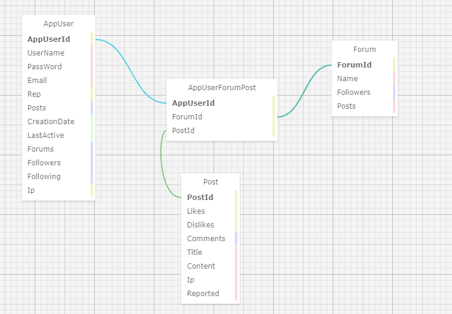

## <div align="center"> Jr Code exchange
#### <div align="center">📚 *Epicodus Team Week # 2  (Week 7 of C#)  04/05-08/2021* </div> 
***<p align="right">By Tien Nguyen, Connor Burgess, Michael Kriegel, Daniel Adeyemi***</p>   
<p align="center">


 
</p>
<div align="center">

 
 

</div>


## <div align="center"> 🚩 *Description*:</div>    

##### ***An MVC app mocking Reddit app for code exchange for junior developments. User can view all posts heading and number of likes/dislikes/comments without logging in, but need to log in to create new post, comment like or dislike post which already exists.***

## <div align="center">  🤓 *Relationships between classes:*


## <div align="center"> 🔧 *Setup/Installation instructions:*
#### 🌐 From the web:
* Go to my GitHub repository, using following [URL](https://github.com/Tien96ng/jr-code-exchange.git).
* * At the top of the repository, click  then select "Download ZIP".


* Unzip the file, navigate to the `CodeExchange` directory to check code
#### ⚙️ From the terminal: 
* Clone my repository from GitHub using `git clone https://github.com/Tien96ng/jr-code-exchange.git` in your terminal or GitBash
* Navigate to the downloaded folder using ***cd*** command
* Execute **code .** command in your terminal and it will open all source code in your code editor.    
⚠️ *Note: To run this project locally you will need to have .NET Core. You can check if you have .NET Core by running `dotnet --version` in the command line. If you do not have .NET Core please find more information and download [here](https://dotnet.microsoft.com/download/dotnet).*

<a name="sql"></a>

## <div align="center"> 🗃️ SQL setup and connection to the application

<details>

### <summury>🧰 Database Setup Options </summary>

#### AppSettings:

- After you have the project on your computer you will need to create a file in the root directory of the project called "appsettings.json". 
- Add the following snippet of code to the appsettings.json file:

```
{
    "Logging": {
    "LogLevel": {
      "Default": "Warning",
      "Microsoft": "Information",
      "System": "Information"
    }
  },
  "AllowedHosts": "*",
  "ConnectionStrings": {
    "DefaultConnection": "Server=localhost;Port=3306;database=daniel_adeyemi;uid=[YOUR-ACCOUNT-NAME];pwd=[YOUR-PASSWORD];"
  }
}
```
*Please note you will need to replace `YOUR-PASSWORD-HERE` with the password you created for your MySQL server.*    
*You may also need to update `uid`, `port`, or `database` name depending on your configurations.*

#### Import Database using Entity Framework Core:

 - In the command line run ` cd Desktop/jr-code-exchange/CodeExchange` to navigate to the "CodeExchange" folder. 
 - Next, run `dotnet ef database update` to generate the database. You can confirm the database was created by checking MySQL workbench.

*⚠️ Note: to make changed to the database you can run `dotnet ef migrations add <MigrationName>`*
</details>


### <div align="center">  🖥️ View website:
*GitHub page is not available for this project. To view functionality you need to run `dotnet run` from **CodeExchange** folder. After that you will see `http://localhost:5000`, click on that link and it will open web appliction in your default browser. In order to exit from local host use **Ctrl+C** command.*

## <div align="center"> 🛠️ *Technologies used:*
* C# 9
* .NET 5.0
* ASP.NET Core MVC
* ASP.NET Identity
* Razor View Egine
* RESTful Routing, CRUD & HTTP
* CSHTML and CSS
* Bulma v 0.9.2
* REPL
* Git and GitHub
* MySQL and MySQL Workbench
* Entity Framework Core

## <div align="center"> 🐛 *Known bugs:*
| Bug | Reason | Possible solution  | State (fixed/current)|
| :-------------: |  :------------: | :-------------: |:-------------: |
| Create AppUserId for connection between classes insted of using Identity.User.Id | User.Id hashed by Identity and looks like impossible to extract | Read Identity Documentation | ❌  **Current**|
| Big word without spaces in Forums/Posts messing up layout of the page| no condition to check and put substring |implement simple check for length of the string without white spaces and cut it at certain point | ❌  **Current** |
| Possible bug| Reason |Possible solution | State |

## <div align="center"> 🌟 *Improvement opportunities:*
* deploy web app

##  <div align="center"> 📬 Contact Information
#### For any questions contact *[Tien](mailto:tien96ng+github@gmail.com?subject=[GitHub/Team_Project])*, *[Connor](mailto:connorburgesscodes+github@gmail.com?subject=[GitHub/Team_Project])*, *[Mikey](mailto:mikkrieg+github@gmail.com?subject=[GitHub/Team_Project])* or *[Daniel](mailto:adeyemidany+github@gmail.com?subject=[GitHub/Team_Project])*

<a name="license"></a>

## <div align="center"> 📘 *License and copyright:*

> ***© Tien Nguyen, Connor Burgess, Michael Kriegel,Daniel Adeyemi, 2021***  
> ⚖️ *[](https://opensource.org/licenses/MIT)*